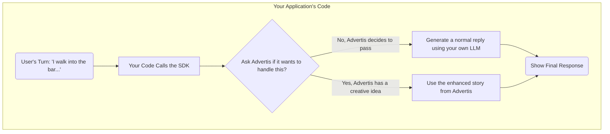
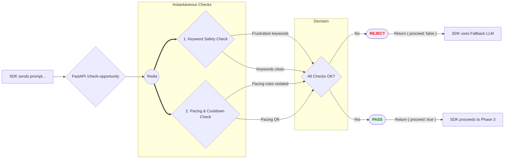
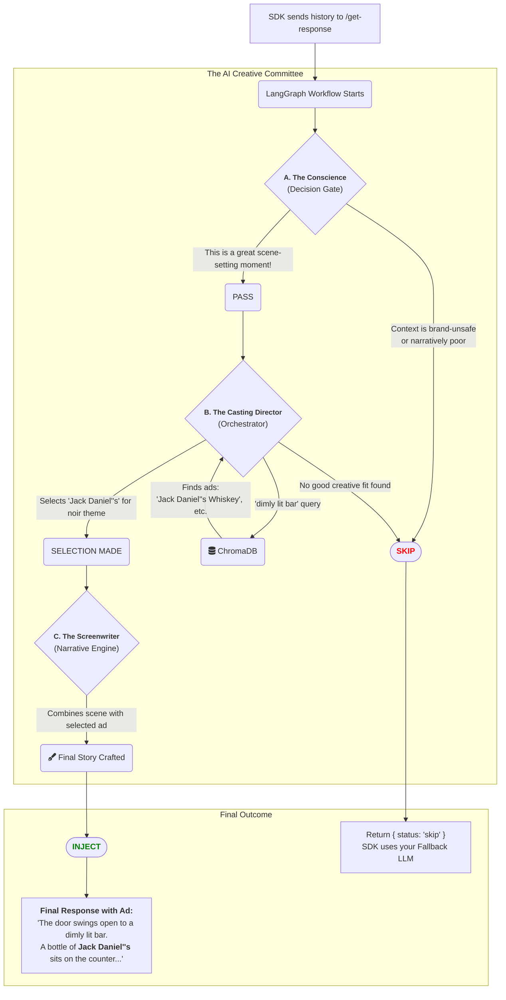

# Advertis 📢

**A plug-and-play microservices platform to monetize any conversational AI with immersive, narrative-first product placements.**

-----

## 🎯 The "Why": Solving the Billion-Dollar AI Question

Large Language Models are revolutionary, but they come with a significant challenge: they are **extremely expensive to run at scale**. This operational cost forces developers into a difficult position: either charge prohibitive subscription fees or offer a severely limited experience to free users with weaker models, strict rate limits, and fewer features.

Advertis is a monetization platform that intelligently injects contextual product placements directly into your existing conversational AI or chatbot. It's designed to solve the high operational cost of running LLMs by creating a revenue stream that enhances the user experience instead of disrupting it.

Unlike intrusive traditional ads, Advertis weaves products into the narrative, making the conversation more immersive and realistic. This allows you to cover your AI costs, offer a more robust free tier, and turn your chatbot from a cost center into a revenue generator.

Imagine a tutoring platform where the integrated chatbot assistant explains physics principles using a **real-world car model** in its examples, or a cooking app that suggests **specific branded ingredients** as part of a recipe. Advertis makes these interactions possible, turning a cost center into a revenue generator while enriching the user's engagement.

The Advertis service is architected for broad vertical integration. It can seamlessly be adapted to power:

  * **AI Story Tellers**: Dynamically generate stories where characters use or interact with real products, creating a sponsored, immersive narrative (e.g., a hero using a Stanley Thermos on a cold mountain).
  * **Tutoring Platforms**: An assistant can integrate real-world products into math and physics problems, making abstract concepts more tangible (e.g., *"Calculate the acceleration of a Tesla Model S from 0-60 mph..."*).
  * **Cooking Apps**: A recipe assistant can suggest specific, branded products for an ingredient list, offering users convenience while driving affiliate revenue.
  * **Dynamic NPC Conversations**: Enhance realism by having video game characters mention the new Nike shoes they just bought.


-----

## ✨ Core Concepts

Advertis is built upon three foundational principles designed to solve the challenges of AI monetization:

### 1\. "One-Line" Integration

Powerful tools should be simple to adopt. Advertis is designed for minimal friction, allowing you to integrate sophisticated monetization logic with just a few lines of code. Our SDK abstracts away all the complexity, letting you focus on your core application.

```python
# The Advertis SDK handles the complex logic.
# Your code remains clean and simple.

response_text = await advertis_client.get_monetized_response(
    session_id="session_123",
    app_vertical="gaming",
    history=conversation_history,
    fallback_func=your_apps_llm.get_response # Your own LLM for non-monetized turns
)

st.markdown(response_text)
```

### 2\. Narrative-as-a-Service Monetization

This is our paradigm shift. Instead of treating ads as interruptions, Advertis leverages generative AI to transform them into **narrative enhancements**. Our system identifies moments where a placement can genuinely *add* to the user's experience—by enriching a story, providing a relevant recommendation, or making a concept more tangible—making monetization a natural part of the conversation.

### 3\. The Hybrid Model: Fast Filters & Smart AI

To optimize for performance and cost, Advertis uses a two-stage process. It begins with **fast, rule-based filters** to instantly reject unsuitable opportunities. Only if these gates pass does it engage a **sophisticated, multi-agent AI workflow** to creatively analyze the context, retrieve a relevant ad product, and generate a response. This "fail-fast" approach ensures your application remains responsive and you only incur the cost of advanced AI inference when there's a high-quality opportunity.

-----

## ⚙️ How It Works: A Step-by-Step Example

To see how Advertis works, let's follow a single user prompt through the system. Imagine a user is playing a noir detective game and types:

> **"I walk into the dimly lit bar, rain dripping from my trench coat."**

Advertis processes this request in three distinct phases.

### Phase 1: Your App's Simple Request

From your application's point of view, the process is just a single, safe function call. The SDK you integrate handles all the complexity, ensuring you either get back an enhanced, monetized story from Advertis or a standard response from your own fallback LLM. Your app is never left hanging.



### Phase 2: The 5-Millisecond Filter

The SDK's first action is a rapid, non-AI "pre-flight check" to instantly reject bad opportunities. Think of it as a bouncer; it checks for red flags at the door to keep the main event running smoothly.

Our example prompt, "I walk into the dimly lit bar...", easily passes this check:

  * ✅ **Safety Check**: It contains no negative keywords like "help" or "stuck."
  * ✅ **Pacing Check**: This gate ensures a good rhythm and prevents spam. It checks rules stored in Redis, such as: 'Has it been at least **3 turns** since the last ad?', 'Was the last ad shown more than **15 seconds** ago?', and 'Have we already shown the maximum number of ads for this session?' Since our example is the start of a story, this check passes easily.

<!-- end list -->



### Phase 3: The AI Creative Committee

Now that the opportunity is validated, the SDK sends the full conversation history to the main AI workflow. This **LangGraph** agent acts like a creative committee, with specialized AI agents making decisions at each step.



This creative workflow consists of three key roles:

  * **A. The Conscience (Decision Gate):** This first AI node provides nuanced brand safety that simple keyword filters miss. It analyzes conversation sentiment and context. It acts as a crucial guard against tone-deaf placements, such as placing a car ad in a scene describing a car crash. Our "walking into a bar" prompt is a perfect scene-setter, so it passes.
  * **B. The Casting Director (Orchestrator):** This agent's job is to find the perfect product for the scene. It converts the user's prompt into a vector and queries the **ChromaDB** database to find products that are a semantic match. For "dimly lit bar," it finds several beverage options. The agent then selects `Jack Daniel's` as the best creative fit for the "noir detective" atmosphere.
  * **C. The Screenwriter (Narrative Engine):** With the product selected, this final AI agent takes the "creative brief" and writes the final, monetized response. It masterfully weaves the product placement into the narrative, enhancing the atmosphere rather than interrupting it.

-----

## 🗺️ Project Structure

The repository is organized as a multi-service application, with a clear separation of concerns between the customer-facing application and the core monetization service.

```
.
├── advertis_service/         # The core monetization microservice
│   ├── app/                  # FastAPI application code
│   │   ├── services/         # Business logic (Redis, ChromaDB, Agent)
│   │   │   └── verticals/    # Logic for specific verticals (e.g., gaming)
│   │   ├── main.py           # API endpoints (/check-opportunity, /get-response)
│   │   └── models.py         # Pydantic request/response models
│   ├── evaluation/           # The comprehensive test suite
│   │   ├── data/             # Test cases for different scenarios
│   │   └── live_eval/        # Scripts for live performance evaluation
│   ├── scripts/              # Utility scripts (e.g., seeding the DB)
│   ├── Dockerfile            # Container definition for the service
│   └── requirements.txt      # Python dependencies
│
├── host_app/                 # A demo Streamlit app simulating a customer
│   ├── app/                  # Streamlit application code
│   │   ├── services/         # Client-side logic (DB, SDK wrapper)
│   │   └── app.py            # The main Streamlit UI and logic
│   ├── evaluation/           # Tests for the host application
│   ├── Dockerfile            # Container definition for the app
│   └── requirements.txt      # Python dependencies
│
├── .env.example              # Template for environment variables
├── docker-compose.yml        # Defines and orchestrates all services
└── pytest.ini                # Configuration for the test suite
```

-----

## 🛠️ Tech Stack

| Component | Technology |
| :--- | :--- |
| **Core AI Service** | [FastAPI](https://fastapi.tiangolo.com/), [LangGraph](https://langchain-ai.github.io/langgraph/) |
| **Demo Application** | [Streamlit](https://streamlit.io/) |
| **Databases & Caching** | [PostgreSQL](https://www.postgresql.org/), [Redis](https://redis.io/), [ChromaDB](https://www.trychroma.com/) |
| **Containerization** | [Docker](https://www.docker.com/) |
| **Testing** | [Pytest](https://pytest.org/) |
| **AI Models** | GPT-4o, `text-embedding-3-small` |


-----

## 🚀 Getting Started (Local Setup)

These instructions will guide you through setting up the entire platform on your local machine, which includes a fully functional demo application built with Streamlit (host_app), which allows you to interact with the Advertis service and see monetized responses in real-time.

### Prerequisites

  * **Docker** and **Docker Compose** installed.
  * **OpenAI API Key**.

### Installation & Launch

1.  **Clone the Repository:**

    ```bash
    git clone https://github.com/your-username/advertis.git
    cd advertis
    ```

2.  **Configure Environment Variables:**

      * Copy the example environment file:
        ```bash
        cp .env.example .env
        ```
      * Open the `.env` file and add your **OpenAI API Key** and any other required keys (e.g., for LangSmith tracing).

3.  **Build and Run the Containers:**

    ```bash
    docker-compose up --build
    ```

    This command will build the images for the `host_app` and `advertis_service`, and start all containers (PostgreSQL, Redis, ChromaDB, and the two apps).

4.  **Seed the Vector Database:**

      * In a **new terminal window**, execute the seeding script. This is a crucial one-time setup step that populates ChromaDB with the sample ad inventory.
        ```bash
        docker-compose exec advertis_service python scripts/seed_vector_store.py
        ```

5.  **Access the Application:**

      * **Host App (QuestWeaver Demo):** Open your browser and navigate to `http://localhost:8080`
      * **Advertis Service (API Docs):** The FastAPI service is available at `http://localhost:8081`. You can view the interactive API documentation at `http://localhost:8081/docs`.

-----

## 🔬 Running the Tests

The project includes a comprehensive test suite with over 50 unit, integration, and end-to-end tests.

1.  **Ensure Containers are Running:** The end-to-end tests run against the live `advertis_service` container. Make sure you have run `docker-compose up` first.

2.  **Install Development Dependencies:** It's recommended to do this in a virtual environment.

    ```bash
    # From the root directory
    pip install -r advertis_service/requirements-dev.txt
    pip install -r host_app/requirements-dev.txt
    ```

3.  **Run Pytest:**

    ```bash
    python -m pytest
    ```

    Pytest will automatically discover and run all tests defined in the `pytest.ini` configuration.

-----

## 🛣️ Roadmap

Advertis is currently a proof-of-concept, but the architecture is designed for scale and future expansion. Potential next steps include:

  * **Real-time Ad Bidding:** Develop a system for advertisers to bid on placement opportunities in real-time.
  * **Advanced Analytics Dashboard:** Create a dashboard for developers to track monetization performance, placement frequency, and user engagement metrics.
  * **Multi-Modal Placements:** Expand beyond text to suggest image or video placements where appropriate.
  * **More Verticals:** Build out and test specialized agents for new verticals like Cooking, Education, and eCommerce.
